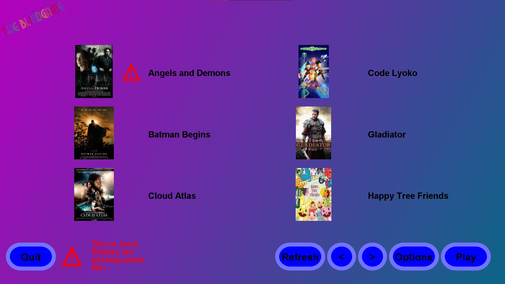

  
  
  
  

# Blindtest
* Easy to use
* Simple interface
* Any theme is supported
* An category is supported
* File sharing on LAN included

  

## How to install

Download latest version [here !](https://github.com/Gildur7161/Blindtest/releases)

If you have already Java installed on your computer, just download the "without JRE" version. If you're not sure or you don't know what is Java or what is JRE, or just if you want a portable version, download the "with JRE" version.

No need to install, just uncompress it wherever you want and you're done !

## How to use

### Create your theme

You can add as many themes as you want. 
1) Create a folder in the "files" directory
2) Add in your freshly created folder the audio file (currently support mp3 and wav files). If you don't, a warning icon will be displayed on the main screen and beside the theme. You can aunch anyway, but the theme will not be used
3) Add the theme cover as a png, jpg, or jpeg file. If you don't, an "Image not found" cover will be displayed
4) Copy the "theme.properties" file from another theme or from the one in the "bin" directory. You you don't, one will be created automatically on launch
5) Add the theme type in the "bin\types.txt" file if it is not already in 

#### theme.properties infos

- `title` - The movie/TV show/cartoon/... the theme is from
- `composer` - The theme composer(s)
- `type` - The category the theme is from (ex: Film, TV show, cartoon, ...)
- `release` - The release date
- `timecode` - The time in second from where you want to start your theme from
- `infos` - Any idditionnal informations

All fields must be on one line, including the infos one. The game will take care of it

### In-game content

  

- You can click on a theme cover to modify any informations within "theme.properties"
- You can play the theme in this panel (will start from the timecode in corresponding field) : the play button will inform you about the current time code. You can change the timecode and restart from it without having to get back to the main menu

  

#### Options

  

- Easy : 20s to guess
- Medium : 15s to guess
- Hard : 10s to guess

- Choose the category(ies) you want to use my checking the checkboxes (clicking on the category name will work too)

## License

This project is under Apache License 2.0 - see [LICENSE.md](LICENSE.md) for more details.

# Donate
You can buy me a coffee using this link (trust me, it helps keeping projects like this updated): https://paypal.me/AmauryChabane
